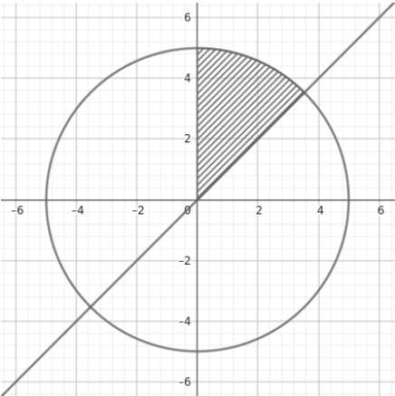
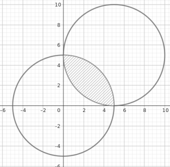

# Сeдмица 2 - Примитивни типове данни

- за по удобно
  `a += 5 "==" a = a + 5`
  `a -= 5 "==" a = a - 5`
  `a *= 5 "==" a = a * 5`
  `a /= 5 "==" a = a / 5`
  `a %= 5 "==" a = a % 5`

### Оператор `++` `--` постфиксен и префиксен

- `a++` - добавя 1 към стойността на a
- `++а` - добавя 1 към стойността на а

##### Тогава каква е разликата?

`a++` връща СТАРАТА стойност на а и инкрементира променливата.

```c
int a = 5;
std::cout << a++ * 2;
std::cout << a;
```

`++a` инкрементира променливата и връща НОВАТА стойност.

```c
int a = 5;
std::cout << a++ * 2;
std::cout << a;
```

- за `--` важи същото нещо

### Преобразуване на типове

- Експлицитно - изрично е указано

```c
double pi = 3.14;
int p = (int)pi;
```

- Имплицидно

```c
int a = 5;
std::cout << a / 10.0
```

## Задачи

### Задача 1

Да се изведе дали прочетен символ е малка латинска буква.

### Задача 2

Програмата чете две числа, но като символи от конзолата. Да се изведе сумата на char-овете по следния начин (десетиците и единиците трябва отново да са символи).

```c
5 8
Sum -> Desetici: 1 Edinici: 3
```

### Задача 3

Прочитат се две числа от конзолата. Булев израз дали се делят едно на друго.

### Задача 4

При подадени минути, да се превърнат в години, дни и часове.

```c
Minutes: 3456789
Years: 6 Days: 210 Hours: 13
```

### Задача 5

По дадена цена и процент на намаление на продукт(0-100) да се изчисли крайната цена - трябва да е закръглена до втория знак след запетаята (без външни функции).

```c
Price: 59.99
Discount: 20
Final Price: 47.99
```

### Задача 6

По 3 дадени страни на триъгълник (приема се, че е валиден) да се изчисли площта му по Хероновата формула - `S = √[p(p-a)(p-b)(p-c)]`, където p е полупериметърът.

```
3 4 5
6
```

### Задача 7

Да се прочете цяло четирицифрено положително число от конзолата и да напише булев израз за това дали числото е палиндром(чете се еднакво отляво надясно и отдясно наляво).

### Задача 8

Да се провери дали точка (x,y) принадежи на защрихованата област. (Булев израз)
a)

b)

