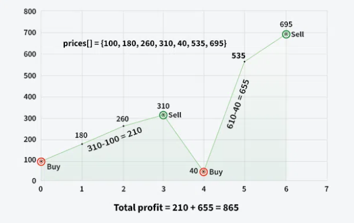

# Седмица 4 - Едномерни Масиви

[Github assignment](https://classroom.github.com/a/WobhTmYu)

- преговор масиви
- сравнение
- копиране
- read-only?

## Bubble sort

- последователно големите елементи изплуват на крайни позиции(естествено, ако е нарастващ)
- сравняваме два съседни елемента
- кога е по-добър от selection sort?


---

## Задачи

---

### Задача 1.

Напишете функция, която приема масив от цели числа и връща броя на елементите, които са по-големи от средната стойност на всички елементи в масива.

```c
IN: 5 9 1 3 11 4 2
OUT: 9 11
```

---

### Задача 2.

Да се намери втория по големина елемент в масив от целочислени числа.

````c
IN: 5 3 9 2 8 1
OUT: Second maximum element: 8
``
```c
IN: 7 7 7 7
OUT: No second maximum element found!
````

---

### Задача 3.

При даден масив да се изтрият всички елементи на четни позиции.

```c
IN: 1 2 3 4 5 6 7
OUT: [ 2, 4, 6 ]
```

---

### Задача 4.

Да се напише функция, която изтрива всички повтарящи се елементи в сортиран масив и принтира последователно числото `n` - броя уникални елементи в масива, и резултатния масив. Решението да не използва допълнителен масив.

```
IN: 1 1 2 2 3 4 4 4 5 5 5 5
OUT: 5 [ 1, 2, 3, 4, 5 ]
```

---

### Задача 5.

При даден масив от цели числа да се изведе броя на повтарящите се елементи.

```c
3 8 1 5 9 1 1 3
Duplicates: 2 //(1, 3)
```

---

### Задача 6.

Четат се от конзолата са два сортирани масива. Да се слеят в един сортиран масив.

```c
IN:
1 4 5 8 10
-1 4 6 9 9 11 19 20
OUT:
[ -1, 1, 4, 4, 5, 6, 8, 9, 9, 10, 11, 19, 20 ]
```

---

### Задача 7.

\*\* Чете се signed short от конзолата, да се изведе числото в двоична бройна система - Ако числото е отрицателно да се изведе в two`s compliment.

- Как се смята two`s compliment

1. Превръща се положителното число в двоична бройна система.
2. Обръщат се всички битове - 1 става 0, 0 става 1.
3. Добавя се едно.

```
IN: 20
OUT: 0000 0000 0001 0100
```

```
IN: -20
OUT: 1111 1111 1110 1100
```

### Задача 8.

Фирма на "Wallstreet" иска невероятните умения на някой програмист от висока класа да изчисли колко е могла да спечели за минал период от време.
Напишете функция която от даден масив от цени на акцията по дни, изчислява най-големия възможен приход.



```c
IN: 100 180 260 310 40 535 695
OUT: Max Profit: 865
```

---

### Задача 9.

Кръгов масив с дължина n наричаме масив, чиито първи и последен елемент са съседни. Циркулярно идентични кръгови масиви ще наричаме такива, че единият може да се получи с ротация на другия. Да се напише програма, която при два кръгови масива проверява дали са равни.

```
IN:
arr1 = [1, 2, 3, 4, 5]
arr2 = [3, 4, 5, 1, 2]
OUT:
True
```

```
IN:
arr1 = [1, 2, 2, 3]
arr2 = [2, 1, 2, 3]
OUT:
False
```

### Задача 10.

Даден е масив от малки латински букви. Да се изведе дължината на максималната последователност от различни букви.

```c
IN: a a b a b c d a b c
OUT: 4
```
