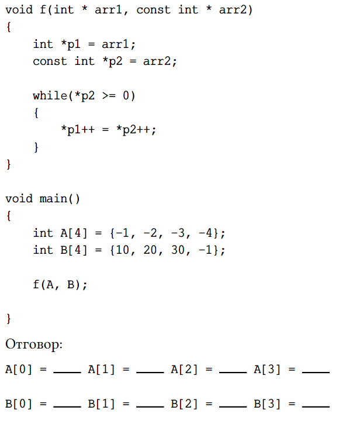

# Седмица 8 - Динамична памет и подготовка за контролно 2 - 24.11.2025г.

### [Github classroom](https://classroom.github.com/a/--v_gUD7)


## Динамична памет
**stack**
- паметта се заделя ПРЕДИ да се компилира програмата.
- паметта се освобождава/трие/маркира като свободна автоматично - при излизането от scope-а,  в който е дефинирана.

Искаме памет по време на изпълнението на програмта?
**heap** 
 - Масиви и обекти без предварително да е известна големината.


Оператор **new**

- Връща указател към началото на паметта

```c++
new int[n];  n НЕ е задължително да е константа!
```

Динамичната памет НЕ се трие автоматично.

Оператор delete[] - освобождава/маркира като свободна динамична памет!    
**НЕ трябва да се извиква повече от веднъж!**


```c++
void f()
{
  int x = 40;
  char ch[2] = {'a', 'b'};
  int* ptr = new int[3];
}
```

След приключването на функцията ще се изчисти паметта в стека, но НЕ и паметта в heap-а.

Ние трябва ръчно да я маркираме като свободна.

```c++
void f()
{
  int x = 40;
  char ch[2] = {'a', 'b'};
  int* ptr = new int[3];
  delete[] ptr; //!!!!!!!
}
```


## Задачи

### 0. задача
В дадените по-долу празни места попълнете какви ще бъдат стойностите на елементите на двата масива A и B след обръщението към функцията f.



### 1. задача
Въведете матрица от конзолата - първо се въвеждат размерите и после се въвеждат самите елементи.
По въведена матрица, запишете минималния елемент от всеки ред в отделен масив.

### 2. задача
Триъгълна матрица се нарича такава квадратна матрица, която има само нулеви елементи под или над главния или вторичния си диагонал. Да се напише функция, която проверява дали подаден двумерен масив, с размерност size x size, е триъгълна матрица.

### 3. задача
**Напишете архитектурно решение!**   
Реализирайте симулатор на морски шах, чийто размер на дъската е `n`. Програмата да позволява на двама играчи един след друг да въвеждат от клавиатурата координатите, на които искат да поставят своя символ `o` или `x`. Играта завършва, когато някой от двамата играчи успее да запълни всички полета на даден ред, колона или диагонал (главен или второстепенен) със своя символ.

### 4. задача
**Напишете архитектурно решение!**  
Реализирайте програма, която ви помага с решаването на Судоку и трябва да изпълнява следните изисквания:
- Трябва да приема Судоку с размери `N` на `N`. Судоку се състои от N на брой квадратчета, разположени в квадратна мрежа, и не съдържа еднакви цифри по ред, колона и в едно квадратче, а всяко квадратче съдържа всички цифри от 1 до N.
- Трябва да позволява на потребителя въвежда число на дадена празна позиция.
- При попълване на всички празни квадратчета да се изпише дали судокуто е попълнено правилно.
