# Седмица 11 - Подготовка за контролно 3 - 21.12.2025г.

### [Github classroom](https://classroom.github.com/a/Ed566RU6)

### [Задачи от допълнителното обучение](https://github.com/Introduction-to-Programming-2025/Introduction-to-programming-group-8/tree/main/week%2011/additional%20class)

## Задачи
### 1. задача (от ДИ)
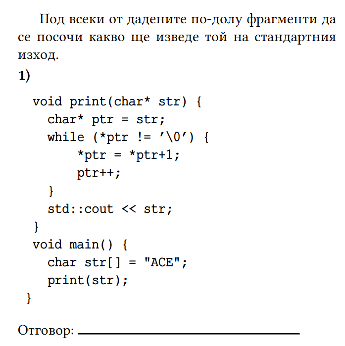
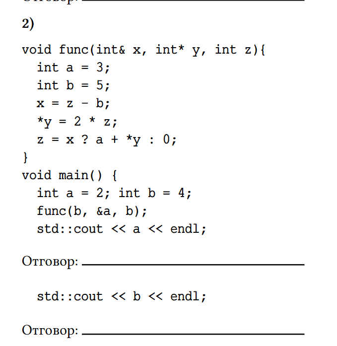
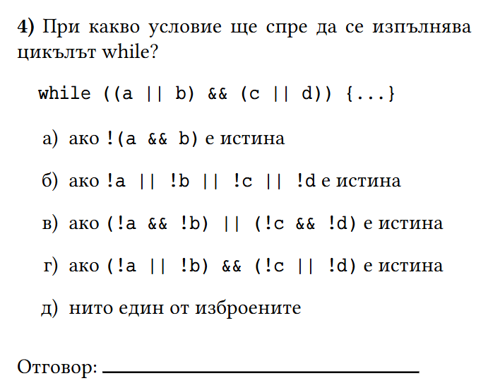
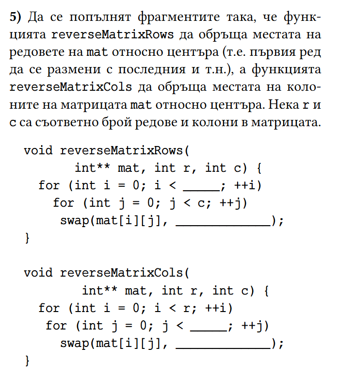
### 2. задача (от ДИ)
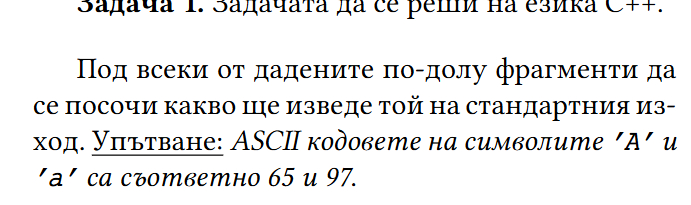
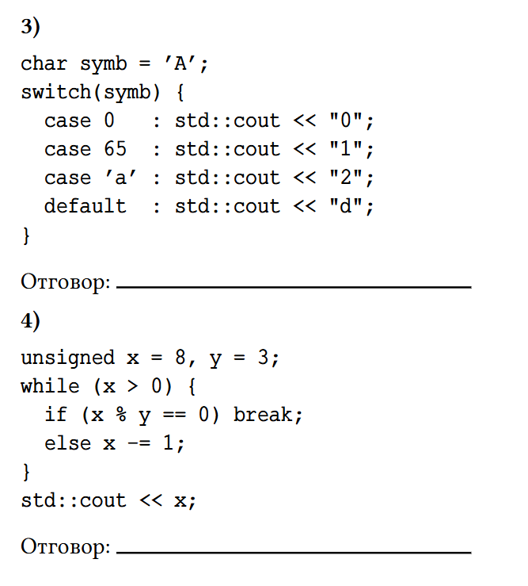
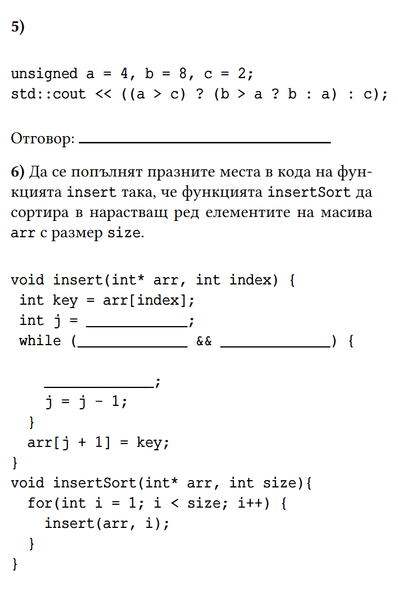
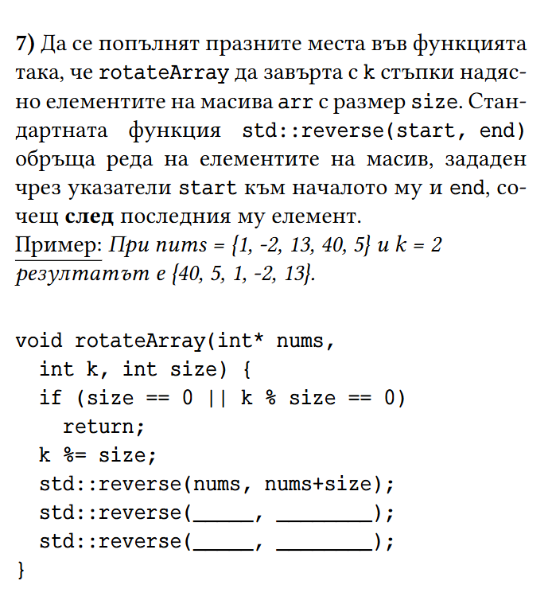
### 3. задача (от ДИ)
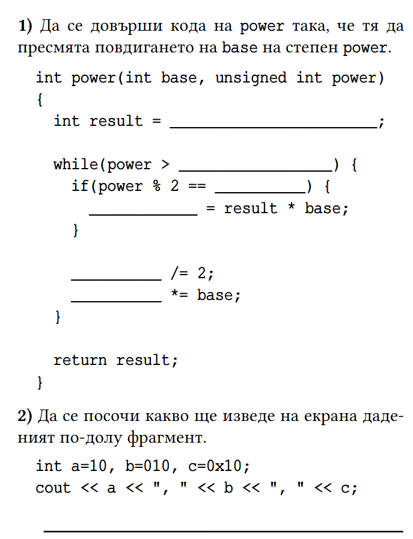
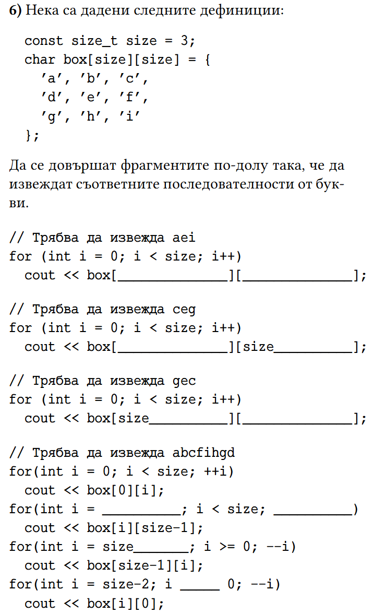
### 4. задача (от ДИ)
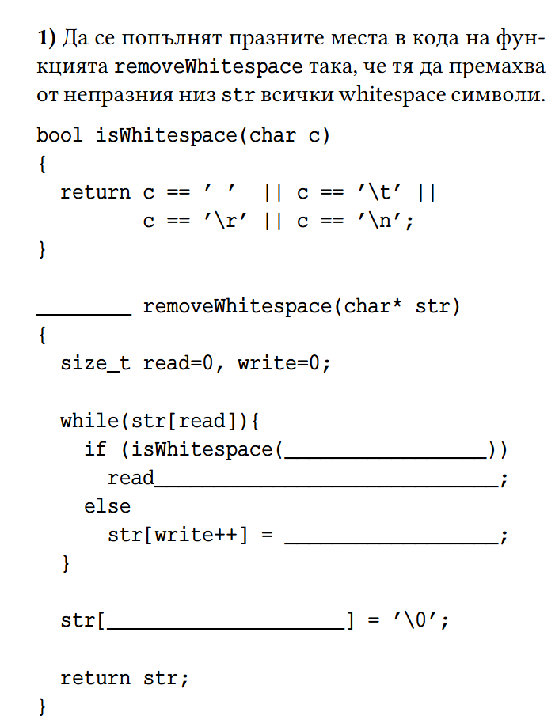
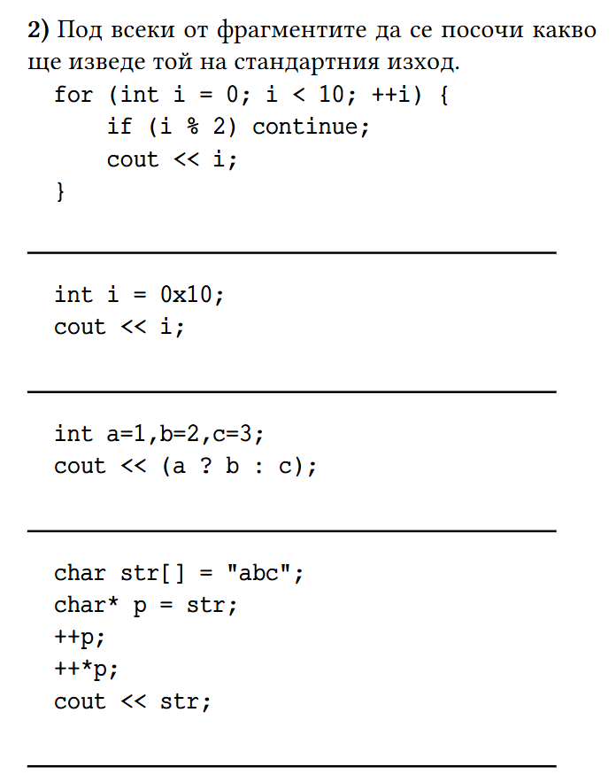
### 5. задача (от минало контролно)
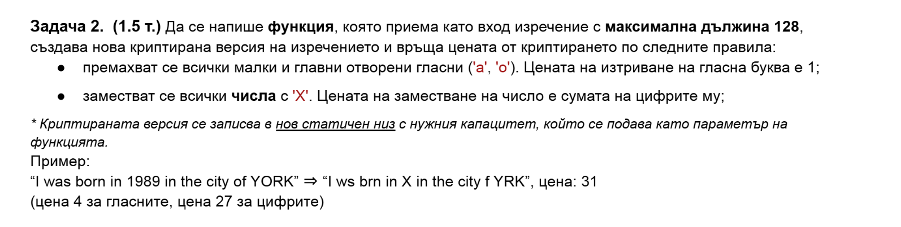
### 6. задача (от минало контролно)
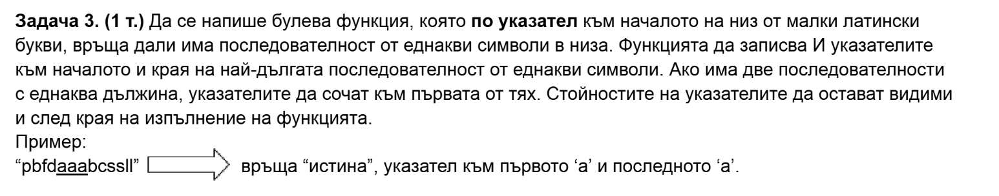
