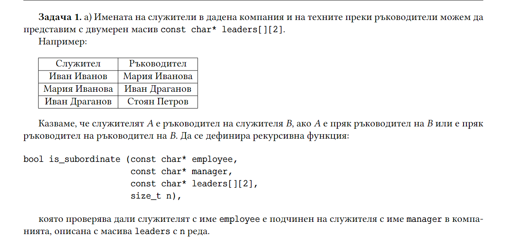
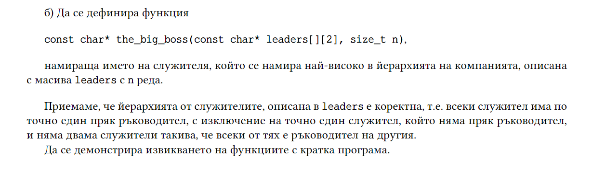

# Седмица 13 - Backtracking - 12.01.2026г.

### [Github classroom](https://classroom.github.com/a/qroDwuyw)
## Задачи
## 1. задача
Даден е двумерен масив с размери NxM, образуван от 1 и 0. Област се нарича група съседни единици. Съседни на дадена клетка са тези отгоре, отдолу, отляво и отдясно. Да се изведе броя области в масива.

### Пример:

**Вход:** <br>
4 6 <br>
0 1 1 0 0 0 <br>
1 1 0 1 1 0 <br>
0 0 0 0 0 1 <br>
1 1 1 1 1 0

**Изход:** 4

### Обяснение на примера
Областите са маркирани със съответния номер - от 1 до 4

0 1 1 0 0 0 <br>
1  1 0 2  2 0 <br>
0 0 0 0 0 3 <br>
4  4  4 4 4 0

---

## 2. задача
Напишете функция, която по подадена азбука (едномерен масив от char) и дължина `n`, изписва всички думи, които могат да се образуват с дължина `n`.    
Използвайте функцията, за да изпишете всички думи с дължина по-малка от `m` (въвежда се от клавиатурата).

## 3. задача
Ванката иска да купи подаръци на стойност **M**, като разполага с неограничен брой монети от общо **N** номинала. По колко начина може да стане това?

**Вход**: **M** и **N**, последвани от **N** цели числа – стойностите на монетите.

### Пример:

**Вход:** <br>
10 5 <br>
1 3 10 6 20

**Изход:** 7

### Обяснение на примера
1+1+1+1+1+1+1+1+1+1=10 <br> 
3+1+1+1+1+1+1+1=10 <br>
3+3+1+1+1+1=10 <br>
3+3+3+1=10 <br>
6+1+1+1+1=10 <br>
6+3+1=10 <br>
10=10

## 4. задача
В лабиринт търсим скрито съкровище. Лабиринтът е представен като двумерна матрица, в която проходимите клетки са отбелязани с 1, непроходимите с 0, а съкровището с 42. Напишете програма, използвайки алгоритъмът за връщане назад, която:  
1. Намира дали имат път до съкровището
2. Извежда пътят до съкровището
3. Намира броя на всички пътища до съкровището
4. Извежда всички пътища до съкровището

Пример:  
Лабиринт:  
```
1 1 0 0 42
1 1 0 0 1
0 1 1 1 1
1 1 0 0 1
1 1 0 0 1
```

Резултати:  
1. True
2.
```
0 0  
1 0  
1 1  
2 1  
2 2  
2 3  
2 4  
1 4  
0 4
```
3. 2
4. 
```
0 0  
1 0  
1 1  
2 1  
2 2  
2 3  
2 4  
1 4  
0 4

0 0  
0 1  
1 1  
2 1  
2 2  
2 3  
2 4  
1 4  
0 4
```

## 5. задача


